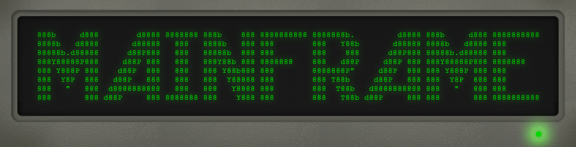
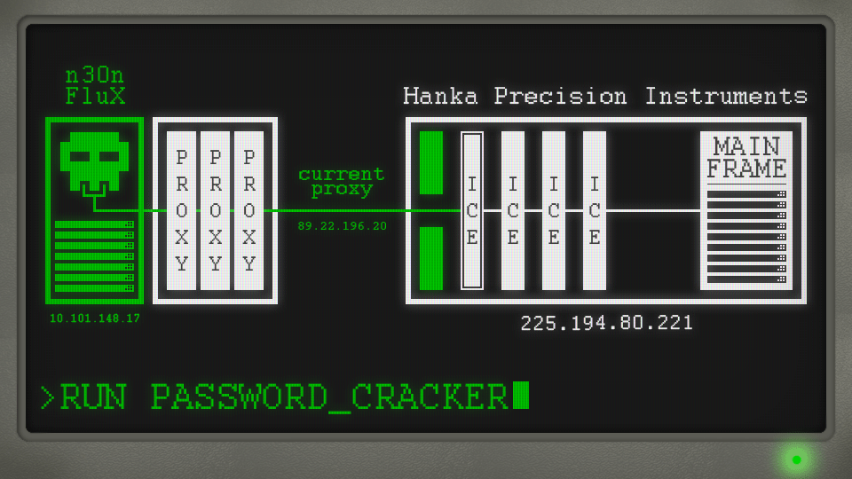

MAINFRAME is a small game, inspired by Warioware and bad 90s movies about hacking.

You are one of the cybernet's most skilled hackers. It's up to you to hide behind proxies, crack through the Corp ICE and access their mainframe. Cracking the ICE involves running one of many subroutines, and failure to crack the ICE during the time limit will result in you being traced, and a layer of proxy protection being removed. Once the last proxy is removed, you're vulnerable to every hacker's worst dream: black ICE.

Can you jam with the console cowboys in cyberspace?

### To-Do List

- ~~Design and make visual assets for:~~
    - ~~Title screen~~
    - ~~Main screen~~
    - ~~Game over screen~~
    - ~~Victory Screen~~
    - ~~Subroutines~~
    - ~~Font~~
    - ~~Check to make sure elements are visually consistent (colour, font weight)~~
    - ~~Animations into own sprite sheets~~

- ~~Finalise subroutines by:~~
    - ~~Updating their names to be thematically consistent~~
    - ~~Packing their textures into atlasses via TexturePacker~~

- Code up the subroutines independently
    - ~~Password Cracker~~
    - ~~Firewall Bypasser~~
    - ~~Worm~~
    - ~~SQL Inject~~
    - ~~Botnet DDoS~~
    - Buffer Overflow
    - Packet Sniffer
    - ~~Voice Cracker~~
	
- Implement subroutine tutorial screens    

- Clean up subroutine code + generalise common functions

- Link up the subroutines to the main screen and implement lives (proxies), game over & game win states

- Music and sound design for everything

- Bug test & upload to itch.io
