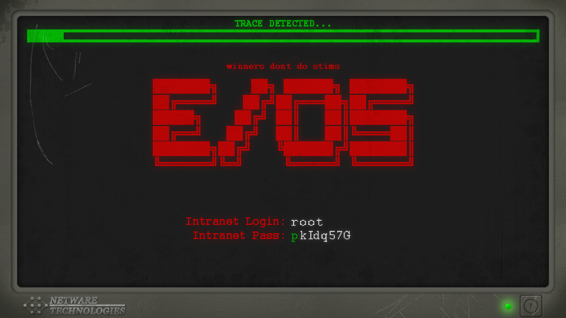

MAINFRAME is a small game, inspired by Warioware and bad 90s movies about hacking.

You are one of the cybernet's most skilled hackers. It's up to you to hide behind proxies, crack through the Corp ICE and access their mainframe. Cracking the ICE involves running one of many subroutines, and failure to crack the ICE during the time limit will result in you being traced, and a layer of proxy protection being removed. Once the last proxy is removed, you're vulnerable to every hacker's worst dream: black ICE.

Can you jam with the console cowboys in cyberspace?

Mainframe was featured on RockPaperShotgun's [best free games of the week](https://www.rockpapershotgun.com/2016/02/27/best-free-games-of-the-week-13/).

# Credits

- [Phaser](http://phaser.io/) for the game engine
- Key press sounds by [eklee & qubodup](http://opengameart.org/content/single-key-press-sounds)
- Music by [Kevin MacLeod](http://incompetech.com/music/royalty-free/index.html?isrc=USUAN1100045)
